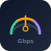
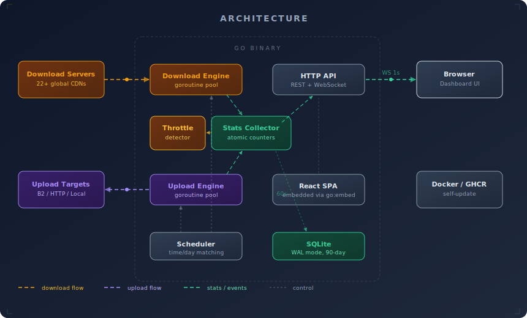

<div align="center">



<br/>

**Detect ISP throttling. Saturate your WAN. Know the truth.**

<br/>

[](https://github.com/wolfebase/floodtest/pkgs/container/floodtest)
[](https://github.com/wolfebase/floodtest/pkgs/container/floodtest)
[](https://go.dev)
[](LICENSE)
[](https://github.com/wolfebase/floodtest/pkgs/container/floodtest)

<br/>

</div>

---

FloodTest generates **real WAN traffic** that registers on your ISP's usage meter. It downloads from 90+ global speed test servers across 16 hosting providers and uploads via HTTP/S3 simultaneously, logging throughput over time to detect exactly when your ISP starts throttling.

Built as a single Go binary with an embedded React dashboard, it runs in a 23MB Docker container and manages itself -- including automatic updates.

<br/>

## Features

<table>
<tr>
<td align="center" width="25%">

<br/>
<strong>Bandwidth Saturation</strong>
<br/>
<sub>Parallel download from 90+ servers with upload to B2/HTTP targets. Auto-adjusts stream count to hit your target speed.</sub>
</td>
<td align="center" width="25%">

<br/>
<strong>Throttle Detection</strong>
<br/>
<sub>Rolling-average monitoring with configurable thresholds. Get alerted when your ISP silently drops your speed.</sub>
</td>
<td align="center" width="25%">

<br/>
<strong>Automated Scheduling</strong>
<br/>
<sub>Run tests on your schedule -- by day and time. Manual override always available from the dashboard.</sub>
</td>
<td align="center" width="25%">

<br/>
<strong>Self-Updating</strong>
<br/>
<sub>Checks GHCR for new images and updates itself via Docker socket. Zero-downtime, no SSH required.</sub>
</td>
</tr>
</table>

<br/>

|  | Capability |
|:---|:---|
| **Control Surface** | Dynamic dashboard that morphs from mode selection into a live command center with throughput gauges, server pool health, and a real-time engine decision log |
| **Traffic Flow** | Animated canvas visualization showing data flowing through providers with particle effects and per-provider speed breakdowns |
| **Smart Auto-Modes** | *Reliable* (auto-tunes to 90% of ISP capacity via built-in speed test) or *Max* (64 download + 32 upload streams, no rate limits) |
| **Server Health** | Provider-grouped accordion view with 90+ servers across 16 hosting providers. Exponential backoff, auto-block at 5 failures |
| **Historical Charts** | 90 days of throughput history with throttle event overlay |
| **Engine Event Log** | Live feed of engine decisions — stream scaling, server cooldowns, recoveries, speed test results — streamed via WebSocket |
| **ISP Speed Test** | Built-in speed test to calibrate your actual line speed |
| **Multi-direction** | Simultaneous download + upload testing with per-direction rate limiting |

<br/>

---

## Quick Start

**One command to install and run:**

```bash
curl -fsSL https://raw.githubusercontent.com/wolfebase/floodtest/main/install.sh | sudo bash
```

Then open **http://your-server-ip:7860** in your browser.

<details>
<summary><strong>Manual Docker Compose</strong></summary>
<br/>

```yaml
services:
  floodtest:
    image: ghcr.io/wolfebase/floodtest:latest
    container_name: floodtest
    restart: unless-stopped
    ports:
      - "7860:7860"
    volumes:
      - floodtest-data:/data
      - /var/run/docker.sock:/var/run/docker.sock   # for self-update
    environment:
      - DATA_DIR=/data
      - COMPOSE_DIR=/opt/floodtest

volumes:
  floodtest-data:
```

```bash
docker compose up -d
```

</details>

<details>
<summary><strong>Update an existing installation</strong></summary>
<br/>

```bash
curl -fsSL https://raw.githubusercontent.com/wolfebase/floodtest/main/update.sh | sudo bash
```

Or let FloodTest update itself from the **Updates** page in the UI.

</details>

<br/>

---

## Architecture

<div align="center">



</div>

<br/>

| Layer | Technology |
|:---|:---|
| **Backend** | Go -- goroutine pools for high-concurrency streaming |
| **Frontend** | React 18 + TypeScript + Tailwind CSS + Recharts |
| **Database** | SQLite with WAL mode (persisted in Docker volume) |
| **Real-time** | WebSocket push every 1 second (stats + engine events) |
| **Container** | 23MB distroless image (multi-arch: amd64 + arm64) |
| **Delivery** | Single binary, frontend embedded via `go:embed` |

<br/>

---

## How It Works

### Download Engine

Downloads large files (1-10 GB) from 90+ public speed test servers across 16 hosting providers in parallel, discarding data to `/dev/null`. Automatically rotates between servers weighted by speed score and load, with exponential backoff (30s to 10 min cap) when one fails. Auto-blocks after 5 consecutive failures. An auto-adjust goroutine monitors throughput every 10 seconds and spins up additional streams if below 80% of target (up to 64 concurrent).

### Upload Engine

Generates random data in memory and uploads via the S3-compatible API or HTTP endpoints. Each object is deleted immediately after upload, keeping storage at zero. Uses `io.Pipe` for zero-copy streaming. Supports Backblaze B2 (free ingress), Cloudflare speed test endpoints, and generic HTTP targets.

### Throttle Detection

Monitors a rolling average of throughput. When it drops below a configurable threshold (default 60%) of the target speed for more than 5 minutes, it logs a throttle event with timestamps, duration, and severity. Events are overlaid on the historical charts for visual correlation.

### Server Health

Each download and upload server is independently tracked with failure counters, speed scores (rolling average of last 5 downloads), and active stream counts. Failed connections trigger exponential backoff (30s, 60s, 120s... capped at 10 min). Servers are auto-blocked after 5 consecutive failures, with one-click unblock from the UI. The dashboard groups servers by hosting provider in a collapsible accordion for easy scanning at scale.

<br/>

---

## Screenshots

> *Screenshots coming soon -- the UI features a dark-themed Control Surface that morphs between mode selection and a live command center, animated traffic flow visualization, provider-grouped server health accordion, historical charts, and schedule manager.*

<br/>

---

## Configuration

All settings can be configured through the web UI. Environment variables override database values on startup.

| Variable | Default | Description |
|:---|:---|:---|
| `WEB_PORT` | `7860` | Web UI and API port |
| `DEFAULT_DOWNLOAD_SPEED` | `5000` | Download target in Mbps |
| `DEFAULT_UPLOAD_SPEED` | `5000` | Upload target in Mbps |
| `DATA_DIR` | `/data` | SQLite database directory |
| `COMPOSE_DIR` | `/opt/floodtest` | Docker Compose file location (for self-update) |
| `B2_KEY_ID` | | Backblaze B2 application key ID |
| `B2_APP_KEY` | | Backblaze B2 application key |
| `B2_BUCKET_NAME` | | B2 bucket name for uploads |
| `B2_ENDPOINT` | `https://s3.us-west-002.backblazeb2.com` | B2 S3-compatible endpoint |

<br/>

---

## System Requirements

| | Minimum | 1 Gbps | 5+ Gbps |
|:---|:---|:---|:---|
| **CPU** | 1 core | 2 cores | 4+ cores |
| **RAM** | 512 MB | 1 GB | 2 GB |
| **Disk** | 1 GB | 2 GB | 2 GB |
| **Network** | Any WAN | 1 Gbps symmetric | 5-10 Gbps symmetric |

> **Note:** CPU is the main bottleneck at high speeds. Disk is only used for the SQLite database -- all download data goes to `/dev/null` and upload data is generated in memory.

<br/>

---

## Backblaze B2 Setup

<details>
<summary><strong>Optional -- enables upload testing via S3 API</strong></summary>
<br/>

FloodTest can use Backblaze B2 for uploads because ingress is **free and unlimited**.

1. Create a free [Backblaze B2 account](https://www.backblaze.com/b2/sign-up.html)
2. Create a private bucket (e.g., `floodtest-uploads`)
3. Generate an Application Key restricted to that bucket
4. Enter the credentials in the FloodTest Settings page

Upload testing also works without B2 using built-in HTTP endpoints (Cloudflare, Tele2).

</details>

<br/>

---

## Unraid

1. Add the container via Docker Compose or Unraid's Docker UI
2. Image: `ghcr.io/wolfebase/floodtest:latest`
3. Map port **7860**
4. Create a path mapping for `/data` to persist settings and history
5. Mount the Docker socket at `/var/run/docker.sock` for self-update
6. Configure through the web UI

<br/>

---

## Contributing

Contributions are welcome. The codebase is straightforward:

```
cmd/server/         Go entrypoint, frontend embedding
internal/           Backend packages (api, config, db, download, upload, stats, events, throttle, scheduler, updater)
frontend/src/       React SPA (TypeScript, Tailwind, Recharts)
```

```bash
# Dev setup
cd frontend && npm ci && npm run dev      # React dev server on :5173
go run ./cmd/server                        # Go backend on :7860

# Production build
cd frontend && npm run build
cp -r frontend/dist cmd/server/frontend/dist
go build -o wansaturator ./cmd/server
```

<br/>

---

<div align="center">

<sub>Built with Go, React, and a healthy distrust of ISPs.</sub>

<br/>

[](https://github.com/wolfebase/floodtest)

</div>
